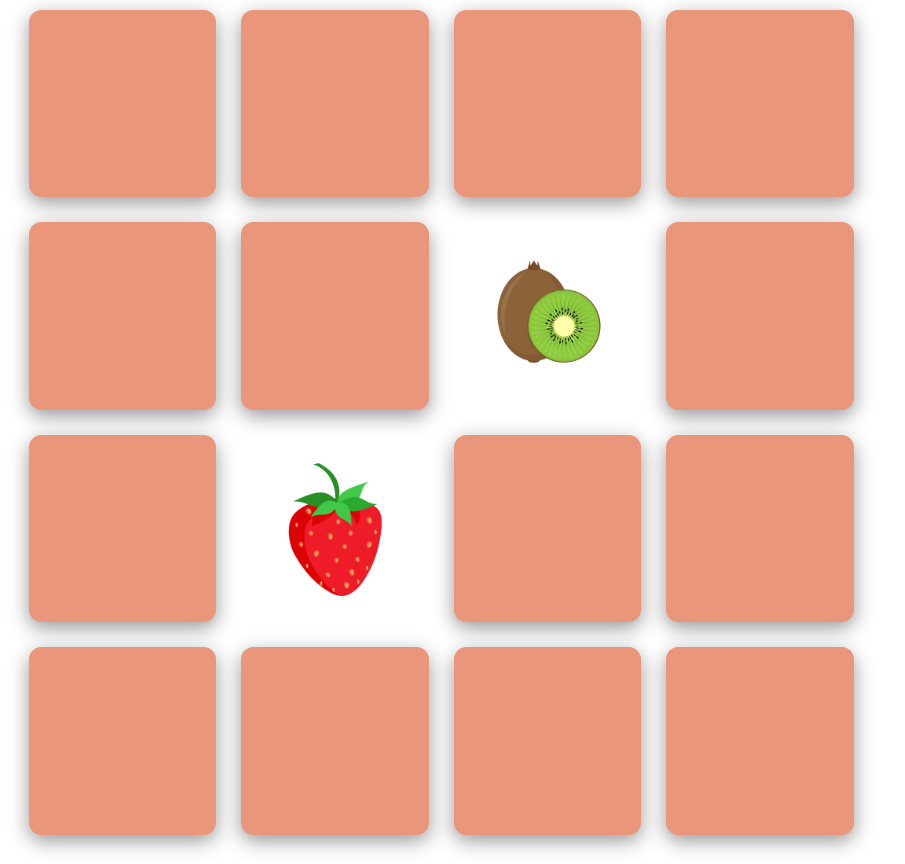

# CardGame
Card game using HTML, CSS, and JavaScript.
https://noran612.github.io/CardGame/
Starting page:

Choose a card by clicking on it:

If the cards are different,the cards unfilp for 1 secound and then flip again:

If the carrds are the same,the cards stay unflipped until the end of the game:

